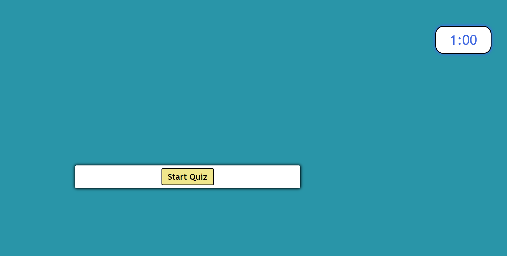
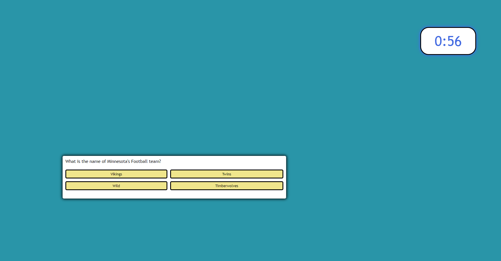
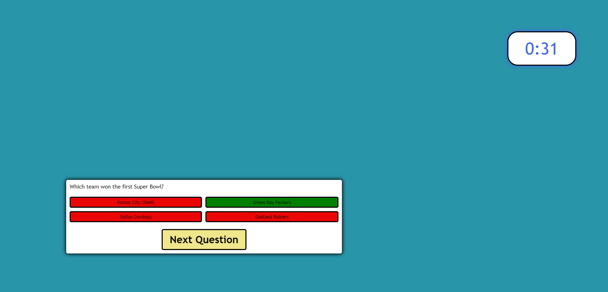

# Code-Quiz-challenge-4-MM

# Challange 4- Quiz with JavaScript-Matthew McElwee

## Purpose
A website is challange #3 for bootcamp so it is an assignment
It is the start of a password generator that I will use to showcase my development skills.

The purpose is the generate a quiz that has a countdown and can store high score

## Built With
* HTML
* CSS
* JavaScript

## Website

https://mmcelwee8002.github.io/Code-Quiz-challenge-4-MM/

## Contribution
Matthew McElwee

### Screenshots of Portfolio
  "Image #1");

   "Image #2");

   "Image #3");
